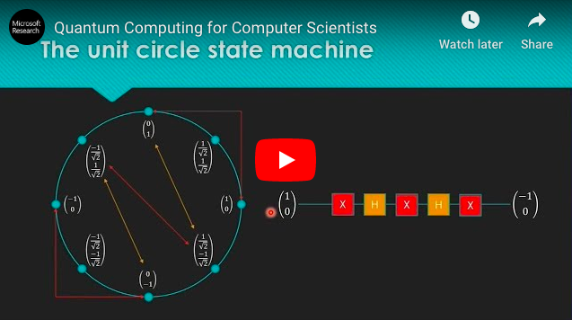
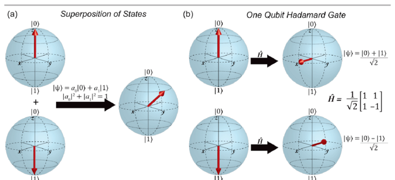

# Video 1: Qubit Rotation Tutorial

In this repository, we will go through the [PennyLane tutorial on qubit rotations](https://pennylane.ai/qml/tutorial/tutorial_qubit_rotation.html). We will talk a little about quantum gates (which are just matrices operating on vectors) and how to interpret quantum circuit diagrams as linear algebra operations. 

## Prerequisites and Dependencies

### Programming Experience
You will not need any programing experience. The vast majority of the coding that you will need to do will be explained in the tutorials. You will be able to get more comfortable with coding in Python as we go. So don't worry if you are not a professional programmer, it is not really needed. If you are really into coding and you're already familiar with Python, then you are a step ahead! There is a [stripped down version](https://github.com/The-Singularity-Research/Video1-Qubit-Rotation/blob/master/qubit_rotation_tutorial1.py) of the Python script that you can run if you like, without all of the frills of the notebook environment and without the tutorial info included in the PennyLane version. All you need to do now is learn linear algebra, tensor products, quantum computing, and machine learning!

### Anaconda and Jupyter
To run the tutorial, we will need Jupyter Notebooks. You can get Jupyter by downloading the latest version of [Anaconda](https://www.anaconda.com/distribution/). You can also run Jupyter Lab right in your browser without having to downlaod anything. Most of our tutorials will run in [Jupyter Lab](https://jupyterlab.readthedocs.io/en/stable/). If you prefer to run Python scripts rather than the interactive environments provided by Jupyter Lab, we will provide Python Scripts as well. We will use terminal some, but not much, but feel free to convert everything over to those environments if you prefer. 

### Math

We have included a [PDF document](Video1_Qubit_Rotation_linear_algebra.pdf) showing how to convert quantum circuit diagrams to linear algebra. 

For example, in the PennyLane tutorial, the following circuit diagram:

can be interpreted as matrix operators, the first operator being:

The PDF document includes the Pauli operators (also called the Pauli gates), the Hadamard gate, and the CNOT gate. There are three circuits. The first two only involve a single qubit and should be very easy for people who already know the basics of linear algebra. If you are not familiar with linear algebra, it is a prerequisite, so it is highly recommended that you go to Khan Academy and go through their [linear algebra course](https://www.khanacademy.org/math/linear-algebra). This should be enough linear algebra to get you through the tutorials. You may also want to quickly review the basics of [complex numbers](https://en.wikipedia.org/wiki/Complex_conjugate) if you are a little rusty on complex conjugates and other basics.

The third circuit involves a CNOT gate on two qubits which means you will need to use a tensor product. If you are unfamiliar with tensor products, we will be using them often so you can get used to them as you go along, treat them as a black-box that the code takes care of, or you can go learn about tensor products in the context of quantum computing in this video:

If you are feeling adventurous, check out the [challenge problems](Video1_Challenge_Problem.pdf). Correct solutions will be featured on the YouTube channel!

## Gate Operations

Quantum gates are just unitary matrix operators that operate on one or several qubits. For example, the Hadamard gate puts a qubit into a superposition of the 0 and 1 state:

Operating on the qubit with other unitary operators (gates) can move it to some position on the Bloch sphere:

More complicated operators may operate on several qubits at a time, each of which might be in a superposition. In this tutorial we focus on a single qubit to keep things simple, but more complicated operations on tensor producst will be needed soon, so be sure to think about the third circuit diagram given in the [Circuit Diagrams to Linear Algebra Document](Video1_Qubit_Rotation_linear_algebra.pdf).
